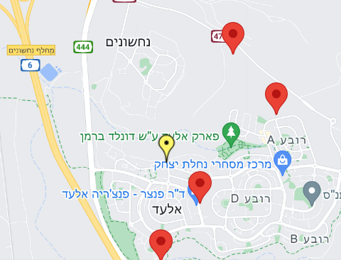

# Security-GPS-map

The current project was developed using React and serves as the client-side component of the project detailed at the following link: 

##### [server side](https://github.com/odelamir/Arrow-projectiles)

##### for the full project process 👇👇

##### [Project book](https://drive.google.com/file/d/1q0O257fhMMjlEKydk6M4gX1ZXdwJTvoX/view?usp=sharing)

# Project Overview

The system receives threat inputs from sensors embedded in soldiers' helmets on the battlefield. Threats identified as hostile are marked on a GPS map, along with the exact time the threat was detected. This feature allows soldiers to view enemy positions on the map, including the precise time hostile fire was detected.

By utilizing this system, soldiers can avoid potential threats, strategically plan their movements, and eliminate enemies from the air. Additionally, the map displays the locations of friendly forces, helping to prevent friendly fire.

A dynamic map that highlights the soldier's location in yellow, while marking the locations of hostile fire detected by sensors in red👇

 

## Key Features

* Dynamic Map Visualization: Highlights the soldier's location in yellow, while marking the locations of hostile fire detected by sensors in red.
* Real-Time Threat Tracking: Displays the exact time and location of detected threats, allowing soldiers to make informed decisions on the battlefield.
* Friendly Fire Prevention: Clearly marks the locations of friendly forces to reduce the risk of friendly fire incidents.

Below is the project in progress👇

  

  👇👇👇
  
 

 
[To view the project on YouTube](https://youtu.be/b7UTdxI-3uE)

### License
This code is proprietary and confidential. You are granted permission to view this code but not to copy, use, distribute, or modify it without explicit permission from the owner.
